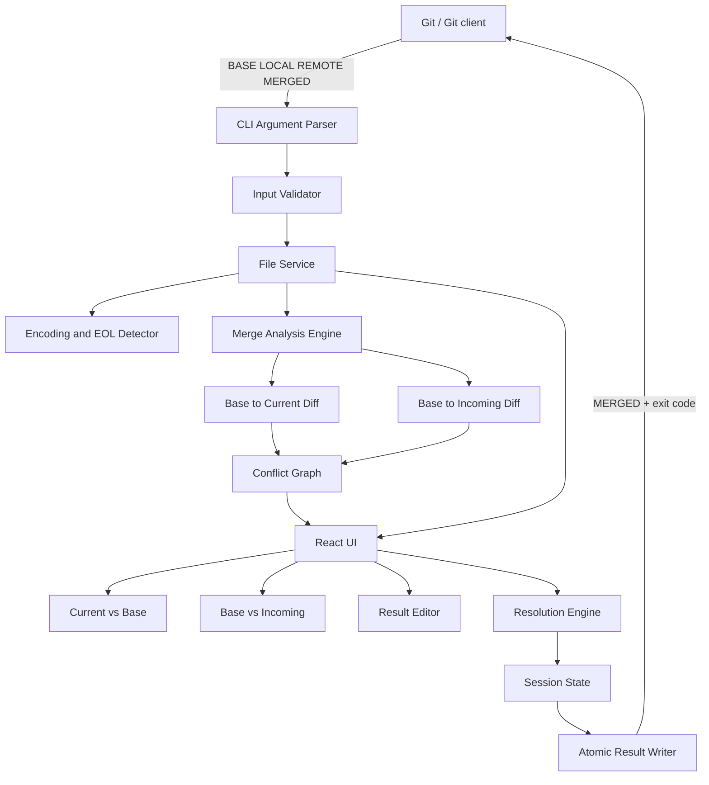
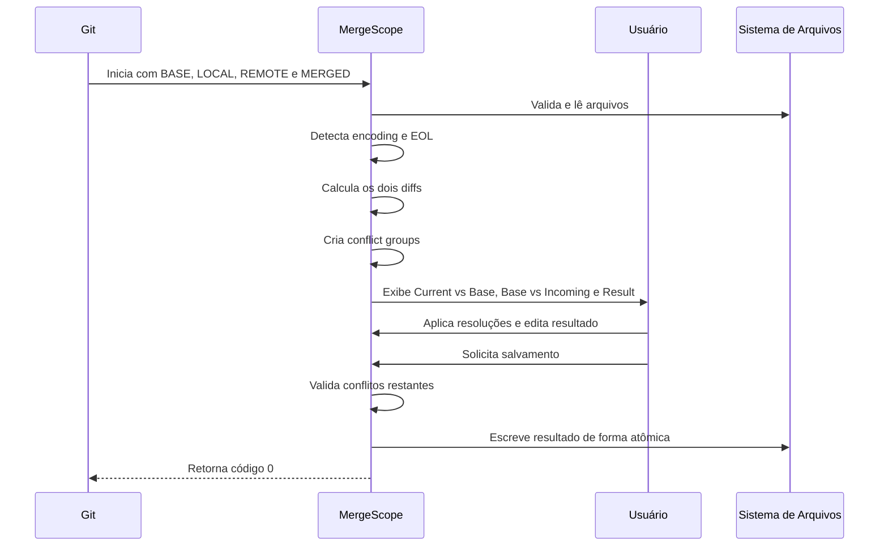

# MergeScope — Especificação Técnica

> **Nome provisório:** MergeScope  
> **Tipo:** Aplicativo desktop de resolução visual de conflitos Git  
> **Status:** Proposta técnica / pré-MVP  
> **Versão do documento:** 0.1.0  
> **Plataforma inicial:** Windows  
> **Plataformas futuras:** macOS e Linux  
> **Licença sugerida:** a definir  
> **Idioma inicial da interface:** inglês, com suporte futuro a internacionalização

---

## 1. Resumo executivo

O MergeScope será uma ferramenta desktop independente para resolução de conflitos Git com visualização simultânea das alterações realizadas por cada lado em relação ao ancestral comum.

A interface principal será composta por:

1. **Current vs Base**
2. **Incoming vs Base**
3. **Merged Result**
4. Visualização opcional do arquivo **Base**

O objetivo é mostrar não apenas o conteúdo final de cada branch, mas também a intenção de cada alteração. Isso reduz o esforço necessário para entender mudanças independentes, alterações em linhas deslocadas, renomeações, exclusões e refatorações concorrentes.

A ferramenta será integrada ao Git por meio do protocolo padrão de `git mergetool`, recebendo os arquivos:

- `BASE`
- `LOCAL`
- `REMOTE`
- `MERGED`

Por ser independente, poderá ser utilizada com:

- Git CLI
- Git worktrees
- Fork
- GitKraken
- VS Code
- IDEs JetBrains
- Outros clientes compatíveis com ferramentas externas de merge

---

## 2. Problema

Ferramentas de resolução de conflitos normalmente apresentam apenas:

- versão atual;
- versão recebida;
- resultado final.

Esse modelo é insuficiente em situações nas quais ambas as branches alteraram o arquivo de formas diferentes.

A posição física de uma linha não representa necessariamente o mesmo conteúdo lógico entre versões. A linha 10 de uma branch pode corresponder à linha 18 de outra devido a:

- inserções anteriores;
- remoções;
- movimentações de código;
- formatação;
- refatorações;
- reorganização de imports;
- alterações paralelas em worktrees.

Sem a comparação de cada lado contra o ancestral comum, o desenvolvedor precisa:

1. abrir o histórico ou diff da versão atual;
2. identificar o que mudou em relação à base;
3. abrir o diff da versão recebida;
4. identificar as mudanças do outro lado;
5. relacionar manualmente as duas alterações;
6. voltar ao editor de conflitos;
7. construir o resultado;
8. revisar se alguma mudança foi perdida.

Esse fluxo aumenta:

- tempo de resolução;
- carga cognitiva;
- risco de remover uma alteração válida;
- risco de aceitar código incompatível;
- dependência de múltiplas ferramentas;
- dificuldade de resolução em arquivos grandes.

---

## 3. Exemplo do problema

### 3.1 Alterações independentes

#### Base

```java
validateOrder(order);
calculateTotal(order);
saveOrder(order);
```

#### Current

```java
validateOrder(order);
applyDiscount(order);
calculateTotal(order);
saveOrder(order);
```

#### Incoming

```java
validateOrder(order);
calculateTotal(order);
validateCreditLimit(order);
saveOrder(order);
```

#### Resultado esperado

```java
validateOrder(order);
applyDiscount(order);
calculateTotal(order);
validateCreditLimit(order);
saveOrder(order);
```

A visualização contra a base evidencia que as alterações são independentes e podem coexistir.

### 3.2 Renomeação e alteração de valor

#### Base

```typescript
const timeout = 3000;
```

#### Current

```typescript
const timeout = 5000;
```

#### Incoming

```typescript
const requestTimeout = 3000;
```

#### Resultado esperado

```typescript
const requestTimeout = 5000;
```

Um lado alterou o valor. O outro renomeou a variável. Comparar apenas Current e Incoming não deixa essa intenção evidente.

---

## 4. Objetivos

### 4.1 Objetivos principais

- Mostrar os dois lados como diffs independentes contra o `BASE`.
- Permitir resolução visual e edição manual do resultado.
- Integrar-se ao fluxo padrão do Git.
- Funcionar corretamente com worktrees.
- Reduzir o tempo e o esforço mental durante merges complexos.
- Evitar perda silenciosa de alterações.
- Ser utilizável a partir de diferentes clientes Git.
- Oferecer interface moderna, clara e orientada a teclado.

### 4.2 Objetivos secundários

- Identificar alterações independentes e sobrepostas.
- Sincronizar a navegação entre os painéis.
- Permitir seleção por linha, bloco e conflito.
- Manter fidelidade de encoding e final de linha.
- Fornecer instalador com configuração automática do Git.
- Permitir integração futura com extensões e plugins.

---

## 5. Fora do escopo inicial

O MVP não incluirá:

- merge semântico completo baseado em AST;
- resolução automática por inteligência artificial;
- colaboração em tempo real;
- editor completo de repositório;
- gerenciamento de branches;
- criação de commits;
- suporte avançado a arquivos binários;
- integração oficial embutida no código do GitKraken;
- sincronização em nuvem;
- servidor remoto.

Esses itens poderão ser avaliados após validação do produto.

---

## 6. Público-alvo

- Desenvolvedores que trabalham com múltiplas branches.
- Usuários de Git worktrees.
- Equipes que mantêm várias versões do mesmo produto.
- Desenvolvedores que realizam backports e cherry-picks.
- Usuários de GitKraken, Fork, VS Code e terminal.
- Projetos com refatorações frequentes.
- Equipes que resolvem conflitos em arquivos grandes.

---

## 7. Terminologia

| Termo | Definição |
|---|---|
| `BASE` | Ancestral comum usado no merge de três vias. |
| `LOCAL` | Versão do lado atual. Também chamada de Current ou Ours. |
| `REMOTE` | Versão recebida. Também chamada de Incoming ou Theirs. |
| `MERGED` | Arquivo de saída que receberá o resultado final. |
| Hunk | Bloco contínuo de linhas adicionadas, removidas ou modificadas. |
| Conflict group | Agrupamento lógico de hunks relacionados pelo intervalo da base. |
| Worktree | Diretório de trabalho adicional associado ao mesmo repositório Git. |
| Resolution | Decisão aplicada ao resultado final para um conflito. |

### 7.1 Nomenclatura visual

A interface usará preferencialmente:

- **Current** para `LOCAL`
- **Incoming** para `REMOTE`
- **Base** para `BASE`
- **Result** para `MERGED`

Os nomes `Ours` e `Theirs` poderão ser exibidos como informação auxiliar, pois seu significado pode variar conforme merge, rebase ou cherry-pick.

---

## 8. Visão funcional

```text
┌───────────────────────────────┬───────────────────────────────┐
│ CURRENT vs BASE               │ BASE vs INCOMING              │
│                               │                               │
│ Alterações do lado atual      │ Alterações do lado recebido   │
│ com contexto da base          │ com contexto da base          │
├───────────────────────────────┴───────────────────────────────┤
│ MERGED RESULT                                                 │
│                                                               │
│ Resultado editável                                            │
├───────────────────────────────────────────────────────────────┤
│ Previous │ Next │ Current │ Incoming │ Both │ None │ Save     │
└───────────────────────────────────────────────────────────────┘
```

### 8.1 Princípio central

Os painéis superiores não devem representar apenas:

```text
Current ↔ Incoming
```

Devem representar:

```text
Base → Current
Base → Incoming
```

O resultado deverá ser construído a partir dessas duas sequências de mudanças.

---

## 9. Requisitos funcionais

### RF-001 — Abertura por linha de comando

O aplicativo deverá aceitar os caminhos dos quatro arquivos:

```bash
mergescope \
  --base "<path>" \
  --current "<path>" \
  --incoming "<path>" \
  --result "<path>"
```

Aliases opcionais:

```bash
--local
--remote
--merged
```

Mapeamento:

```text
--local   = --current
--remote  = --incoming
--merged  = --result
```

### RF-002 — Validação dos argumentos

O aplicativo deverá:

- validar a existência dos arquivos de entrada;
- validar permissão de leitura;
- validar permissão de escrita no resultado;
- aceitar `BASE` ausente quando o Git não fornecer ancestral comum;
- apresentar erro objetivo;
- não modificar o resultado em caso de falha na inicialização.

### RF-003 — Leitura dos quatro estados

O aplicativo deverá carregar:

- conteúdo da base;
- conteúdo atual;
- conteúdo recebido;
- conteúdo inicial do resultado.

O resultado inicial deverá utilizar o conteúdo de `MERGED`, pois o Git pode ter resolvido automaticamente partes do arquivo e mantido marcadores apenas nas regiões conflitantes.

### RF-004 — Diff Current vs Base

O painel esquerdo deverá mostrar:

```text
BASE → CURRENT
```

Deverá destacar:

- linhas adicionadas;
- linhas removidas;
- linhas modificadas;
- mudanças somente de espaços;
- alterações intralinha.

### RF-005 — Diff Base vs Incoming

O painel direito deverá mostrar:

```text
BASE → INCOMING
```

Com os mesmos recursos do painel esquerdo.

### RF-006 — Resultado editável

O painel inferior deverá:

- permitir edição livre;
- suportar syntax highlighting;
- suportar undo e redo;
- exibir números de linha;
- mostrar marcadores de resolução;
- indicar conflitos ainda não revisados;
- permitir busca textual;
- preservar indentação;
- preservar final de linha.

### RF-007 — Visualização da base

O usuário deverá poder:

- abrir a base em painel temporário;
- fixar a base como terceiro painel;
- alternar rapidamente entre Base, Current e Incoming;
- copiar trechos da base para o resultado.

### RF-008 — Navegação entre conflitos

O aplicativo deverá oferecer:

- próximo conflito;
- conflito anterior;
- primeiro conflito;
- último conflito;
- contador de conflitos;
- lista lateral opcional;
- navegação por teclado.

### RF-009 — Ações de resolução

Para cada conflito ou hunk, deverão existir:

- Accept Current
- Accept Incoming
- Accept Both
- Accept Both: Current First
- Accept Both: Incoming First
- Accept Base
- Reject Both
- Mark as Reviewed
- Reset Resolution

### RF-010 — Seleção granular

O usuário deverá poder aplicar ações em:

- conflito completo;
- hunk;
- conjunto de linhas;
- linha individual;
- seleção textual.

### RF-011 — Correlação dos dois lados

O aplicativo deverá relacionar alterações usando o intervalo correspondente na base.

Exemplo:

```text
Base linhas 20–24
├── Current: alterou linhas 20–22
└── Incoming: inseriu após linha 23
```

Essas mudanças deverão aparecer como parte do mesmo grupo lógico ou como grupos adjacentes relacionados.

### RF-012 — Alterações independentes

Quando os lados modificarem intervalos diferentes da base, a interface deverá sinalizar:

```text
Independent changes
```

A ferramenta poderá sugerir a aplicação automática de ambos, mas deverá permitir revisão antes de salvar.

### RF-013 — Alterações sobrepostas

Quando os lados modificarem intervalos sobrepostos da base, a interface deverá sinalizar:

```text
Overlapping changes
```

O resultado não deverá ser assumido automaticamente no MVP.

### RF-014 — Linhas movidas

Quando possível, a ferramenta deverá indicar conteúdo provavelmente movido.

No MVP, a detecção poderá ser heurística e opcional.

### RF-015 — Filtros de visualização

O usuário deverá poder alternar:

- mostrar arquivo completo;
- mostrar somente mudanças;
- mostrar somente conflitos;
- ignorar espaços em branco;
- ignorar alteração de final de linha;
- expandir contexto;
- recolher regiões sem mudanças.

### RF-016 — Rolagem sincronizada

A rolagem deverá poder ser sincronizada por:

- intervalo da base;
- grupo de conflito;
- posição proporcional;
- modo independente.

A sincronização por número absoluto de linha não deverá ser o comportamento principal.

### RF-017 — Salvamento

Ao salvar, a ferramenta deverá:

1. validar o estado atual;
2. escrever em arquivo temporário;
3. garantir flush;
4. substituir `MERGED` de forma atômica quando possível;
5. preservar encoding;
6. preservar EOL;
7. retornar código de saída `0`.

### RF-018 — Cancelamento

Ao cancelar:

- o arquivo `MERGED` não deverá ser sobrescrito;
- o aplicativo deverá retornar código diferente de zero;
- o conflito deverá permanecer pendente no Git.

### RF-019 — Backup

A ferramenta poderá criar backup opcional antes da gravação:

```text
arquivo.ext.mergescope-backup
```

Essa opção deverá ser configurável e desativada por padrão quando o Git já estiver mantendo `.orig`.

### RF-020 — Sessão

Durante a execução, deverá ser possível restaurar:

- tamanho dos painéis;
- conflito selecionado;
- posição de rolagem;
- conteúdo não salvo;
- preferências visuais.

A restauração de conteúdo será limitada à sessão atual no MVP.

### RF-021 — Atalhos

Atalhos mínimos:

| Ação | Windows/Linux | macOS |
|---|---|---|
| Salvar | `Ctrl+S` | `Cmd+S` |
| Fechar/cancelar | `Esc` | `Esc` |
| Próximo conflito | `Alt+Down` | `Option+Down` |
| Conflito anterior | `Alt+Up` | `Option+Up` |
| Accept Current | `Alt+1` | `Option+1` |
| Accept Incoming | `Alt+2` | `Option+2` |
| Accept Both | `Alt+3` | `Option+3` |
| Abrir Command Palette | `Ctrl+Shift+P` | `Cmd+Shift+P` |
| Buscar | `Ctrl+F` | `Cmd+F` |

Os atalhos deverão ser configuráveis futuramente.

### RF-022 — Command Palette

A interface deverá oferecer comandos pesquisáveis, incluindo:

- navegação;
- ações de resolução;
- troca de layout;
- filtros de diff;
- abertura da base;
- salvamento;
- cancelamento.

### RF-023 — Arrastar conteúdo

Versão futura poderá permitir arrastar hunks para o resultado. Não é obrigatório no primeiro MVP.

### RF-024 — Lista de arquivos conflitantes

Quando aberto pelo launcher do MergeScope em um repositório, o aplicativo poderá listar todos os arquivos em conflito.

Quando aberto diretamente por `git mergetool`, poderá operar em um arquivo por processo.

### RF-025 — Launcher de repositório

Comando opcional:

```bash
mergescope open .
```

O launcher deverá:

1. identificar o repositório ou worktree atual;
2. executar `git diff --name-only --diff-filter=U`;
3. listar arquivos não resolvidos;
4. abrir a sessão de resolução;
5. usar os estágios do índice para obter Base, Current e Incoming.

---

## 10. Requisitos não funcionais

### RNF-001 — Desempenho

Metas iniciais:

- inicialização da interface em até 2 segundos em máquina de desenvolvimento comum;
- abertura de arquivo de até 5 MB sem bloqueio prolongado;
- navegação entre conflitos abaixo de 100 ms após processamento;
- processamento em worker ou backend para não bloquear a interface;
- carregamento progressivo para arquivos grandes.

### RNF-002 — Consumo de recursos

- evitar runtime Electron;
- manter consumo de memória controlado;
- não carregar modelos duplicados desnecessariamente;
- liberar modelos Monaco ao fechar arquivo;
- suportar execução múltipla para diferentes worktrees.

### RNF-003 — Confiabilidade

- nenhuma gravação parcial do resultado;
- operação segura em caso de encerramento inesperado;
- validação antes de substituir o arquivo;
- logs locais de erro;
- recuperação de sessão não salva quando possível.

### RNF-004 — Segurança

- processamento local;
- nenhuma transmissão de código pela rede;
- telemetria desativada por padrão;
- atualizações verificadas por assinatura;
- princípio de menor privilégio no backend Tauri;
- comandos permitidos explicitamente;
- sanitização de argumentos e caminhos;
- nenhuma execução automática de scripts do repositório.

### RNF-005 — Privacidade

O MergeScope não deverá enviar:

- conteúdo de arquivos;
- caminhos completos;
- nomes de repositórios;
- nomes de branches;
- dados de conflitos.

Telemetria futura deverá ser opt-in e limitada a métricas anônimas.

### RNF-006 — Compatibilidade

MVP:

- Windows 10 e 11;
- Git moderno disponível no PATH para funções de launcher;
- arquivos de texto UTF-8;
- CRLF e LF.

Futuro:

- UTF-16;
- outros encodings detectáveis;
- macOS;
- Linux.

### RNF-007 — Acessibilidade

- navegação completa por teclado;
- foco visível;
- contraste adequado;
- suporte a zoom;
- não depender somente de cores;
- labels acessíveis;
- ícones acompanhados de tooltip;
- suporte a temas de alto contraste.

### RNF-008 — Internacionalização

- textos externos ao código;
- idioma padrão inglês;
- estrutura preparada para português;
- chaves estáveis de tradução.

---

## 11. Experiência visual

### 11.1 Direção de design

A interface deverá ser:

- técnica;
- limpa;
- moderna;
- densa sem ser poluída;
- orientada a produtividade;
- consistente com ferramentas de desenvolvimento.

Evitar:

- excesso de gradientes;
- animações longas;
- elementos decorativos sem função;
- cores intensas em áreas grandes;
- excesso de bordas;
- janelas modais desnecessárias.

### 11.2 Estrutura

```text
┌────────────────────────────────────────────────────────────────────┐
│ MergeScope │ arquivo.ts │ merge/rebase/cherry-pick │ 3/8 conflicts │
├────────────────────────────────┬───────────────────────────────────┤
│ Current vs Base                │ Base vs Incoming                  │
│ [Full] [Changes] [Whitespace]  │ [Full] [Changes] [Whitespace]    │
│                                │                                   │
│ Diff editor                    │ Diff editor                       │
│                                │                                   │
├────────────────────────────────┴───────────────────────────────────┤
│ Result                                                             │
│ [Accept Current] [Incoming] [Both ▼] [Base] [Reject]               │
│                                                                    │
│ Editable result                                                    │
│                                                                    │
├────────────────────────────────────────────────────────────────────┤
│ 2 unresolved │ UTF-8 │ CRLF │ Ln 120, Col 14 │ Cancel │ Save       │
└────────────────────────────────────────────────────────────────────┘
```

### 11.3 Painéis

Os painéis deverão ser:

- redimensionáveis;
- recolhíveis;
- reorganizáveis futuramente;
- persistidos por preferência;
- utilizáveis em telas ultrawide;
- utilizáveis em notebooks.

### 11.4 Temas

Temas iniciais:

- Dark
- Light
- System
- High Contrast

Os tokens semânticos devem incluir:

```text
diff.added
diff.removed
diff.modified
diff.moved
diff.conflict
diff.independent
diff.resolved
diff.unresolved
editor.background
editor.border
editor.focus
```

### 11.5 Estados visuais

Cada conflict group deverá indicar:

- unresolved;
- partially resolved;
- resolved;
- manually edited;
- independent;
- overlapping;
- ignored;
- reviewed.

---

## 12. Arquitetura proposta

### 12.1 Stack

| Camada | Tecnologia |
|---|---|
| Desktop shell | Tauri 2 |
| Front-end | React + TypeScript |
| Editor | Monaco Editor |
| Backend local | Rust |
| Estado da interface | Zustand ou equivalente leve |
| Testes unitários front-end | Vitest |
| Testes de componentes | Testing Library |
| Testes E2E desktop | WebdriverIO ou solução compatível com Tauri |
| Formatação | Prettier |
| Lint | ESLint |
| Build | Vite + Tauri CLI |

### 12.2 Motivos da escolha

#### Tauri

- aplicação desktop com frontend web;
- backend local em Rust;
- binários menores que uma abordagem baseada em Electron;
- suporte multiplataforma;
- controle de permissões;
- integração com sistema operacional.

#### Monaco Editor

- syntax highlighting;
- diff editor;
- edição de texto;
- minimap;
- decorations;
- folding;
- busca;
- navegação;
- suporte a múltiplas linguagens.

### 12.3 Diagrama



### 12.4 Separação de responsabilidades

#### Front-end

Responsável por:

- renderização;
- navegação;
- seleção;
- comandos;
- edição do resultado;
- preferências;
- comunicação com backend.

#### Backend Rust

Responsável por:

- argumentos;
- sistema de arquivos;
- encoding;
- EOL;
- escrita atômica;
- integração com Git;
- detecção de worktree;
- logs;
- abertura segura de arquivos;
- processamento pesado futuro.

#### Merge Analysis Engine

Responsável por:

- geração de diffs;
- normalização de hunks;
- correlação pela base;
- classificação de conflitos;
- criação do conflict graph;
- aplicação de resoluções.

---

## 13. Modelo de dados

```typescript
type Side = "base" | "current" | "incoming" | "result";

type ChangeKind =
  | "equal"
  | "insert"
  | "delete"
  | "modify"
  | "move";

type ConflictStatus =
  | "unresolved"
  | "partial"
  | "resolved"
  | "reviewed";

type ConflictClassification =
  | "independent"
  | "overlapping"
  | "current-only"
  | "incoming-only"
  | "same-change"
  | "delete-modify"
  | "unknown";

interface LineRange {
  start: number;
  end: number;
}

interface DiffHunk {
  id: string;
  source: Side;
  baseRange: LineRange;
  targetRange: LineRange;
  kind: ChangeKind;
  originalLines: string[];
  modifiedLines: string[];
}

interface ConflictGroup {
  id: string;
  baseRange: LineRange;
  currentHunks: DiffHunk[];
  incomingHunks: DiffHunk[];
  classification: ConflictClassification;
  status: ConflictStatus;
  resolution?: Resolution;
}

interface Resolution {
  strategy:
    | "current"
    | "incoming"
    | "both-current-first"
    | "both-incoming-first"
    | "base"
    | "none"
    | "manual";
  resultRange?: LineRange;
  updatedAt: string;
}
```

---

## 14. Motor de diff e merge

### 14.1 Estratégia do MVP

O MVP poderá usar:

- Monaco Diff Editor para renderização;
- API de mudanças de linha do Monaco para navegação visual;
- camada própria para normalizar os dois diffs;
- correlação dos hunks pelo intervalo da base;
- resultado inicial carregado do arquivo `MERGED`.

### 14.2 Processo

```text
BASE + CURRENT
      ↓
Diff A
      ↓
Hunks normalizados
      ┐
      ├── Conflict Graph
      ┘
Hunks normalizados
      ↑
Diff B
      ↑
BASE + INCOMING
```

### 14.3 Correlação de hunks

Dois hunks serão relacionados quando:

- seus intervalos na base se sobrepuserem;
- um for inserção na fronteira imediata do outro;
- houver proximidade configurável;
- houver similaridade textual indicando movimentação.

### 14.4 Classificação

#### Current-only

Somente Current alterou o intervalo.

#### Incoming-only

Somente Incoming alterou o intervalo.

#### Independent

Os dois lados alteraram regiões diferentes que podem coexistir.

#### Same-change

Os dois lados produziram conteúdo equivalente.

#### Overlapping

Os dois lados alteraram o mesmo intervalo com resultados diferentes.

#### Delete-modify

Um lado removeu o conteúdo e o outro modificou.

#### Unknown

Não foi possível classificar com segurança.

### 14.5 Estratégias de diff

Configurações futuras:

- Myers;
- Patience;
- Histogram;
- comparação por palavra;
- comparação ignorando whitespace.

O algoritmo usado para renderização e o usado para classificação poderão ser independentes.

### 14.6 Merge semântico futuro

Plugins poderão analisar linguagens específicas:

- TypeScript/JavaScript;
- Java;
- JSON;
- XML;
- YAML;
- ObjectScript;
- C#;
- Python.

Possíveis recursos:

- identificar renomeação;
- combinar imports;
- detectar mudança de valor e nome;
- validar estrutura;
- aplicar formatador após resolução.

---

## 15. Fluxo principal



---

## 16. Contrato da CLI

### 16.1 Execução principal

```bash
mergescope.exe \
  --base "C:\temp\file_BASE.ts" \
  --current "C:\temp\file_LOCAL.ts" \
  --incoming "C:\temp\file_REMOTE.ts" \
  --result "C:\repo\src\file.ts"
```

### 16.2 Argumentos

| Argumento | Obrigatório | Descrição |
|---|---:|---|
| `--base` | Não | Arquivo ancestral comum. |
| `--current` | Sim | Arquivo do lado atual. |
| `--incoming` | Sim | Arquivo do lado recebido. |
| `--result` | Sim | Arquivo de saída. |
| `--repo` | Não | Caminho explícito do repositório/worktree. |
| `--title` | Não | Título da janela. |
| `--current-label` | Não | Label do lado atual. |
| `--incoming-label` | Não | Label do lado recebido. |
| `--readonly` | Não | Abre somente para inspeção. |
| `--wait` | Não | Mantém o processo até a janela fechar. |
| `--no-backup` | Não | Desabilita backup interno. |
| `--log-level` | Não | `error`, `warn`, `info`, `debug`, `trace`. |

### 16.3 Códigos de saída

| Código | Significado |
|---:|---|
| `0` | Resultado salvo com sucesso. |
| `1` | Usuário cancelou ou deixou sem resolução. |
| `2` | Argumentos inválidos. |
| `3` | Falha de leitura. |
| `4` | Falha de gravação. |
| `5` | Falha interna no motor de merge. |
| `6` | Arquivo foi alterado externamente durante a sessão. |

### 16.4 Saída de diagnóstico

Por padrão, erros devem ir para `stderr`.

Modo estruturado futuro:

```bash
mergescope --json ...
```

Exemplo:

```json
{
  "status": "write_error",
  "code": 4,
  "path": "C:/repo/src/file.ts",
  "message": "Unable to replace result file"
}
```

---

## 17. Integração com Git

O Git permite configurar uma ferramenta customizada usando `mergetool.<tool>.cmd`.

### 17.1 Configuração global no Windows

```bash
git config --global merge.tool mergescope

git config --global mergetool.mergescope.cmd \
  '"C:/Program Files/MergeScope/MergeScope.exe" --base "$BASE" --current "$LOCAL" --incoming "$REMOTE" --result "$MERGED" --wait'

git config --global mergetool.mergescope.trustExitCode true
git config --global mergetool.prompt false
git config --global mergetool.keepBackup false
```

### 17.2 Configuração equivalente em `.gitconfig`

```ini
[merge]
    tool = mergescope

[mergetool "mergescope"]
    cmd = "\"C:/Program Files/MergeScope/MergeScope.exe\" --base \"$BASE\" --current \"$LOCAL\" --incoming \"$REMOTE\" --result \"$MERGED\" --wait"
    trustExitCode = true

[mergetool]
    prompt = false
    keepBackup = false
```

### 17.3 Uso

```bash
git mergetool
```

Arquivo específico:

```bash
git mergetool src/services/OrderService.ts
```

### 17.4 Rebase e cherry-pick

A interface deverá evitar assumir que:

```text
LOCAL = minha branch
REMOTE = branch de outra pessoa
```

Em rebase e cherry-pick, a interpretação pode ser diferente.

Por isso, os labels principais serão:

```text
Current
Incoming
Base
Result
```

Informações adicionais poderão ser obtidas do repositório quando disponíveis.

---

## 18. Suporte a worktrees

### 18.1 Requisitos

A ferramenta deverá:

- tratar cada worktree como contexto independente;
- identificar o diretório raiz da worktree atual;
- não assumir que `.git` é um diretório;
- suportar `.git` como arquivo apontando para o gitdir real;
- não usar estado global compartilhado entre sessões;
- permitir múltiplas janelas em worktrees diferentes;
- mostrar o caminho curto da worktree na barra superior;
- evitar misturar branches, índices ou arquivos temporários.

### 18.2 Detecção

Comandos possíveis:

```bash
git rev-parse --show-toplevel
git rev-parse --git-dir
git rev-parse --git-common-dir
git branch --show-current
git worktree list --porcelain
```

### 18.3 Identidade da sessão

```text
repository common dir
+ worktree root
+ result path
+ process id
```

Essa chave deverá evitar colisões entre conflitos do mesmo arquivo em worktrees distintas.

---

## 19. Integração com Fork

### 19.1 Integração principal

O Fork deverá abrir o MergeScope como ferramenta externa de merge quando a versão instalada permitir configuração de ferramentas externas.

Configuração esperada:

```text
Executable:
C:\Program Files\MergeScope\MergeScope.exe

Arguments:
--base "$BASE" --current "$LOCAL" --incoming "$REMOTE" --result "$MERGED" --wait
```

Os placeholders exatos deverão ser confirmados durante a implementação do adaptador.

### 19.2 Instalador

Opção:

```text
[ ] Configure MergeScope as the Git merge tool
[ ] Add integration instructions for Fork
```

A primeira opção será automatizável por `git config`.

A segunda poderá abrir uma tela com:

- caminho do executável;
- argumentos;
- botão para copiar;
- validação da configuração.

### 19.3 Fluxo

```text
Fork
→ arquivo em conflito
→ Open in External Merge Tool
→ MergeScope
→ Save
→ Fork detecta o arquivo atualizado
→ usuário marca ou confirma resolução
```

---

## 20. Integração com GitKraken

### 20.1 Estratégia garantida

A integração mínima garantida será pelo fluxo padrão do Git:

```text
GitKraken
→ abrir terminal no repositório/worktree
→ git mergetool
→ MergeScope
```

### 20.2 Ferramenta externa

Caso a versão do GitKraken permita selecionar a configuração padrão do Git ou uma ferramenta externa compatível, o MergeScope poderá ser utilizado diretamente.

Como o suporte do GitKraken a ferramentas externas pode depender de uma lista reconhecida pelo aplicativo, a integração direta deverá ser tratada como adaptador específico, não como premissa do núcleo.

### 20.3 Estratégias de evolução

1. Solicitar inclusão oficial do MergeScope.
2. Publicar documentação de configuração.
3. Criar launcher por protocolo URI:
   ```text
   mergescope://open?repo=...
   ```
4. Criar extensão de shell ou comando rápido.
5. Avaliar integração com APIs públicas futuras do GitKraken.

### 20.4 Fluxo inicial recomendado

```text
GitKraken
→ Open Terminal
→ git mergetool
→ MergeScope
→ Save
→ retorno ao GitKraken
```

---

## 21. Integração com VS Code

### 21.1 Uso genérico

O usuário poderá executar no terminal:

```bash
git mergetool
```

### 21.2 Extensão futura

Uma extensão poderá:

- listar conflitos;
- abrir o MergeScope;
- enviar contexto do workspace;
- mostrar status;
- reutilizar o frontend em Webview;
- registrar comando `Open Conflict in MergeScope`.

A aplicação independente continuará sendo o núcleo.

---

## 22. Sistema de arquivos e integridade

### 22.1 Leitura

Ao abrir uma sessão:

1. obter metadados;
2. detectar encoding;
3. detectar BOM;
4. detectar EOL predominante;
5. calcular hash do resultado original;
6. ler conteúdo;
7. manter snapshot imutável.

### 22.2 Gravação atômica

Fluxo:

```text
MERGED
  ↓
escrever arquivo temporário no mesmo volume
  ↓
flush
  ↓
validar conteúdo
  ↓
substituir destino
```

Nome temporário:

```text
.<filename>.mergescope-<pid>.tmp
```

### 22.3 Alteração externa

Antes de salvar, comparar:

- timestamp;
- tamanho;
- hash.

Se o arquivo tiver sido alterado externamente:

```text
The result file changed outside MergeScope.
```

Opções:

- Reload
- Compare
- Overwrite
- Save As
- Cancel

### 22.4 Encoding

MVP:

- UTF-8 sem BOM;
- UTF-8 com BOM;
- ASCII compatível.

Futuro:

- UTF-16 LE/BE;
- Windows-1252;
- detecção configurável.

### 22.5 EOL

Preservar:

- CRLF;
- LF;
- ausência de newline final.

Alertar quando o arquivo possuir EOL misto.

---

## 23. Estado da aplicação

### 23.1 Estado de domínio

- arquivos carregados;
- hunks;
- conflict groups;
- resoluções;
- resultado;
- encoding;
- EOL;
- status de alteração;
- hash inicial.

### 23.2 Estado visual

- painel ativo;
- dimensões;
- conflito atual;
- filtros;
- tema;
- nível de zoom;
- posição de rolagem;
- base fixada;
- minimap ativado.

### 23.3 Persistência

Preferências poderão ser persistidas em:

```text
%APPDATA%\MergeScope\settings.json
```

Sessões temporárias:

```text
%LOCALAPPDATA%\MergeScope\sessions\
```

Nenhum conteúdo de código deverá ser persistido permanentemente sem necessidade.

---

## 24. Estrutura do projeto

```text
mergescope/
├── apps/
│   └── desktop/
│       ├── src/
│       │   ├── app/
│       │   ├── components/
│       │   │   ├── diff/
│       │   │   ├── result/
│       │   │   ├── conflicts/
│       │   │   ├── layout/
│       │   │   └── commands/
│       │   ├── features/
│       │   │   ├── session/
│       │   │   ├── resolution/
│       │   │   ├── navigation/
│       │   │   ├── preferences/
│       │   │   └── integrations/
│       │   ├── editor/
│       │   ├── merge/
│       │   ├── stores/
│       │   ├── types/
│       │   └── main.tsx
│       └── src-tauri/
│           ├── src/
│           │   ├── main.rs
│           │   ├── cli.rs
│           │   ├── files.rs
│           │   ├── encoding.rs
│           │   ├── writer.rs
│           │   ├── git.rs
│           │   ├── worktree.rs
│           │   ├── logging.rs
│           │   └── commands.rs
│           └── tauri.conf.json
├── packages/
│   ├── merge-engine/
│   ├── domain/
│   ├── ui/
│   └── integrations/
├── fixtures/
│   ├── independent-changes/
│   ├── overlapping-changes/
│   ├── delete-modify/
│   ├── moved-code/
│   ├── whitespace/
│   └── encodings/
├── docs/
│   ├── architecture/
│   ├── integrations/
│   └── decisions/
├── scripts/
└── README.md
```

---

## 25. API interna Tauri

Exemplo conceitual:

```typescript
interface OpenMergeSessionInput {
  basePath?: string;
  currentPath: string;
  incomingPath: string;
  resultPath: string;
  repositoryPath?: string;
}

interface OpenMergeSessionOutput {
  sessionId: string;
  files: {
    base?: FileSnapshot;
    current: FileSnapshot;
    incoming: FileSnapshot;
    result: FileSnapshot;
  };
  conflictGroups: ConflictGroup[];
}

interface SaveMergeResultInput {
  sessionId: string;
  content: string;
  expectedOriginalHash: string;
}
```

Comandos:

```text
open_merge_session
save_merge_result
cancel_merge_session
read_git_context
list_unmerged_files
read_index_stages
get_preferences
save_preferences
open_external_path
```

---

## 26. Integração com o índice Git

No modo launcher, os estágios do índice representam:

| Stage | Conteúdo |
|---:|---|
| 1 | Base |
| 2 | Ours/Current |
| 3 | Theirs/Incoming |

Leitura conceitual:

```bash
git show :1:path/to/file
git show :2:path/to/file
git show :3:path/to/file
```

O arquivo no worktree será utilizado como `MERGED`.

Após salvar, o MVP não deverá executar `git add` automaticamente por padrão.

Opção futura:

```text
[ ] Stage file after successful resolution
```

A ação deverá ser explícita.

---

## 27. Tratamento de marcadores de conflito

O resultado inicial pode conter:

```text
<<<<<<< HEAD
current content
=======
incoming content
>>>>>>> branch
```

O parser deverá:

- reconhecer marcadores padrão;
- suportar marcadores com labels;
- reconhecer conflitos `diff3`;
- reconhecer conflitos `zdiff3`;
- preservar regiões já resolvidas;
- não depender exclusivamente dos marcadores;
- usar os quatro arquivos como fonte principal.

Marcadores aninhados ou inválidos deverão gerar diagnóstico.

---

## 28. Testes

### 28.1 Testes unitários

Cobrir:

- parser de argumentos;
- detecção de encoding;
- detecção de EOL;
- normalização de hunks;
- correlação por base;
- classificação;
- aplicação de resolução;
- escrita atômica;
- códigos de saída;
- detecção de alteração externa.

### 28.2 Testes de componentes

Cobrir:

- seleção de conflito;
- botões de resolução;
- navegação;
- filtros;
- painel da base;
- atualização do resultado;
- status visual;
- atalhos;
- confirmação de saída.

### 28.3 Testes de integração

Cenários:

1. merge comum;
2. rebase;
3. cherry-pick;
4. worktree;
5. arquivo com CRLF;
6. arquivo com LF;
7. UTF-8 com BOM;
8. arquivo sem base;
9. arquivo vazio;
10. exclusão contra modificação;
11. duas inserções no mesmo ponto;
12. linhas movidas;
13. arquivo alterado externamente;
14. caminho com espaços;
15. caminho com caracteres Unicode;
16. execução simultânea em duas worktrees.

### 28.4 Fixtures obrigatórias

```text
base.txt
current.txt
incoming.txt
merged.initial.txt
merged.expected.txt
metadata.json
```

Exemplo de metadata:

```json
{
  "name": "rename-and-value-change",
  "classification": "overlapping",
  "expectedStrategies": [
    "manual"
  ],
  "eol": "LF",
  "encoding": "UTF-8"
}
```

### 28.5 Testes E2E

- abrir via CLI;
- resolver conflito;
- salvar;
- validar conteúdo;
- validar exit code;
- cancelar;
- validar que o resultado não foi alterado;
- executar via `git mergetool`;
- retornar ao processo Git.

---

## 29. Observabilidade e logs

### 29.1 Logs locais

Local sugerido:

```text
%LOCALAPPDATA%\MergeScope\logs\
```

Níveis:

- error;
- warn;
- info;
- debug;
- trace.

### 29.2 Dados permitidos

- versão do aplicativo;
- sistema operacional;
- código de erro;
- duração de operações;
- tamanho aproximado do arquivo;
- contagem de conflitos.

### 29.3 Dados a omitir ou mascarar

- conteúdo;
- caminho completo;
- nome do usuário;
- nome do repositório;
- branch;
- dados Git remotos.

---

## 30. Instalação

### 30.1 Instalador Windows

Formato inicial:

- MSI ou NSIS;
- instalação por usuário;
- opção de adicionar ao PATH;
- opção de configurar `git mergetool`;
- opção de criar atalho;
- opção de registrar protocolo URI.

### 30.2 Assistente de configuração

Após instalar:

```text
Configure MergeScope
[x] Set as global Git merge tool
[x] Disable Git mergetool prompt
[x] Trust MergeScope exit code
[ ] Disable Git .orig backups
[ ] Add MergeScope to PATH
```

Alterações em Git config deverão ser exibidas antes da aplicação.

### 30.3 Comando de diagnóstico

```bash
mergescope doctor
```

Saída esperada:

```text
MergeScope version: 0.1.0
Git executable: found
Git version: ...
Global merge tool: mergescope
Executable path: valid
Write test: passed
WebView2: available
Status: ready
```

---

## 31. Atualizações

- atualização automática opcional;
- canal stable;
- canal beta futuro;
- pacote assinado;
- changelog;
- possibilidade de atualização manual;
- nenhuma atualização durante uma resolução ativa.

---

## 32. Roadmap

### Fase 0 — Prova de conceito

Objetivo: validar o layout.

Entregas:

- Tauri + React;
- três painéis;
- Monaco Diff Editor nos dois lados;
- Monaco Editor no resultado;
- arquivos fixos carregados localmente;
- layout redimensionável.

### Fase 1 — MVP técnico

Entregas:

- argumentos `BASE`, `CURRENT`, `INCOMING`, `RESULT`;
- leitura e validação;
- dois diffs contra a base;
- resultado editável;
- navegação entre mudanças;
- ações Current, Incoming e Both;
- salvamento;
- códigos de saída;
- integração com `git mergetool`;
- Windows;
- tema escuro e claro.

### Fase 2 — MVP utilizável

Entregas:

- conflict graph;
- classificação independent/overlapping;
- atalhos;
- command palette;
- restauração de layout;
- tratamento CRLF/LF;
- UTF-8 BOM;
- alteração externa;
- instalador;
- configuração automática do Git;
- documentação para Fork e GitKraken.

### Fase 3 — Versão beta

Entregas:

- lista de arquivos conflitantes;
- launcher de repositório;
- suporte robusto a worktrees;
- detecção de linhas movidas;
- filtros avançados;
- staging opcional;
- logs e diagnóstico;
- macOS ou Linux.

### Fase 4 — Recursos avançados

- plugins semânticos;
- integração VS Code;
- integração oficial com clientes Git;
- merge estruturado de JSON/XML/YAML;
- sugestões automáticas;
- API de extensões;
- comparação de múltiplos arquivos;
- suporte a diretórios.

---

## 33. Critérios de aceitação do MVP

O MVP será considerado funcional quando:

1. puder ser iniciado por `git mergetool`;
2. receber corretamente `BASE`, `LOCAL`, `REMOTE` e `MERGED`;
3. mostrar Current vs Base;
4. mostrar Base vs Incoming;
5. mostrar resultado editável;
6. permitir aceitar Current;
7. permitir aceitar Incoming;
8. permitir aceitar ambos;
9. permitir edição manual;
10. navegar entre conflitos;
11. salvar no arquivo `MERGED`;
12. retornar código `0` após salvar;
13. retornar código diferente de zero após cancelar;
14. preservar UTF-8;
15. preservar CRLF ou LF;
16. operar em caminhos com espaços;
17. operar em worktrees;
18. não enviar código pela rede;
19. funcionar no Windows;
20. possuir documentação para integração com Git, Fork e GitKraken.

---

## 34. Métricas de sucesso

Durante testes com usuários:

- tempo médio para resolver um conflito;
- número de alternâncias para outras ferramentas;
- número de alterações perdidas;
- quantidade de undo após resolução;
- conflitos resolvidos sem abrir histórico externo;
- taxa de conclusão;
- avaliação de clareza da interface;
- uso de atalhos;
- uso das classificações independent/overlapping.

Meta qualitativa principal:

> O usuário deve entender o que cada lado alterou sem precisar sair da tela de merge.

---

## 35. Riscos

### Risco 1 — Monaco não fornecer todos os dados necessários

Mitigação:

- manter uma camada própria de diff;
- usar Monaco somente como renderizador;
- permitir substituição do algoritmo.

### Risco 2 — Diferenças de semântica entre merge e rebase

Mitigação:

- evitar labels absolutos Ours/Theirs;
- usar Current/Incoming;
- mostrar contexto da operação;
- criar testes específicos.

### Risco 3 — Integração limitada pelo GitKraken

Mitigação:

- integração padrão via `git mergetool`;
- documentação;
- terminal integrado;
- solicitação de suporte oficial;
- manter núcleo independente.

### Risco 4 — Arquivos grandes

Mitigação:

- processamento assíncrono;
- virtualização;
- contexto recolhido;
- limites configuráveis;
- modo de diff simplificado.

### Risco 5 — Perda de conteúdo

Mitigação:

- escrita atômica;
- hash;
- backup opcional;
- confirmação;
- testes de falha;
- nunca sobrescrever no cancelamento.

### Risco 6 — Detecção incorreta de alterações independentes

Mitigação:

- tratar como sugestão;
- exigir revisão no MVP;
- indicar nível de confiança;
- permitir desabilitar automações.

---

## 36. Decisões técnicas iniciais

### ADR-001 — Aplicativo independente

**Decisão:** construir aplicativo desktop independente.

**Motivo:** permite integração com vários clientes e não depende de APIs específicas de uma IDE.

### ADR-002 — Git mergetool como contrato principal

**Decisão:** utilizar o contrato padrão de `git mergetool`.

**Motivo:** fornece `BASE`, `LOCAL`, `REMOTE` e `MERGED` e evita integração proprietária obrigatória.

### ADR-003 — Tauri em vez de Electron

**Decisão:** utilizar Tauri.

**Motivo:** menor footprint esperado, backend seguro em Rust e boa integração desktop.

### ADR-004 — Monaco para edição

**Decisão:** utilizar Monaco Editor.

**Motivo:** fornece editor e diff maduros, além de experiência familiar para desenvolvedores.

### ADR-005 — Engine de merge desacoplada

**Decisão:** o modelo de conflito não deverá depender exclusivamente do Monaco.

**Motivo:** permitir evolução do algoritmo e testes determinísticos.

### ADR-006 — Sem rede por padrão

**Decisão:** todo o processamento será local.

**Motivo:** arquivos de código podem conter informações confidenciais.

---

## 37. Backlog inicial

### Núcleo

- [ ] Inicializar monorepo.
- [ ] Criar aplicação Tauri.
- [ ] Configurar React e TypeScript.
- [ ] Integrar Monaco.
- [ ] Implementar parser CLI.
- [ ] Implementar leitura segura.
- [ ] Implementar detecção de EOL.
- [ ] Implementar detecção de encoding.
- [ ] Criar modelos de domínio.
- [ ] Criar dois diffs contra a base.
- [ ] Criar Result Editor.
- [ ] Implementar salvamento atômico.
- [ ] Implementar códigos de saída.

### UX

- [ ] Layout redimensionável.
- [ ] Toolbar de resolução.
- [ ] Navegação entre conflitos.
- [ ] Status bar.
- [ ] Tema escuro.
- [ ] Tema claro.
- [ ] Command Palette.
- [ ] Atalhos.
- [ ] Base view.
- [ ] Lista de conflitos.

### Integração

- [ ] Gerar configuração `.gitconfig`.
- [ ] Criar comando `mergescope doctor`.
- [ ] Testar `git mergetool`.
- [ ] Testar merge.
- [ ] Testar rebase.
- [ ] Testar cherry-pick.
- [ ] Testar worktree.
- [ ] Documentar Fork.
- [ ] Documentar GitKraken.
- [ ] Criar instalador Windows.

### Qualidade

- [ ] Fixtures.
- [ ] Testes unitários.
- [ ] Testes de integração.
- [ ] Testes E2E.
- [ ] Lint.
- [ ] Formatação.
- [ ] CI.
- [ ] Assinatura de release.
- [ ] Política de segurança.
- [ ] Changelog.

---

## 38. Questões para decisões futuras

- Qual será o nome definitivo?
- O projeto será open source?
- Qual licença será utilizada?
- O resultado deverá ser staged automaticamente?
- Qual algoritmo de diff será o padrão?
- O MVP deverá detectar linhas movidas?
- A interface inicial será somente em inglês?
- Haverá atualização automática?
- Haverá versão portátil?
- Será necessário suportar UTF-16 no MVP?
- Qual será o comportamento quando `BASE` estiver ausente?
- O aplicativo deverá operar com múltiplos arquivos na mesma janela?
- O instalador poderá alterar o Git config automaticamente?
- Qual será a política de telemetria?
- Quais integrações deverão receber suporte oficial primeiro?

---

## 39. Referências técnicas

- [Git — git-mergetool](https://git-scm.com/docs/git-mergetool)
- [Git — git-mergetool--lib](https://git-scm.com/docs/git-mergetool--lib)
- [Git — git-merge-base](https://git-scm.com/docs/git-merge-base)
- [GitKraken — Branch, Merge and Rebase](https://help.gitkraken.com/gitkraken-desktop/branching-and-merging/)
- [GitKraken — Preferences and External Tools](https://help.gitkraken.com/gitkraken-desktop/preferences/)
- [Fork — Release Notes for Windows](https://git-fork.com/releasenoteswin)
- [Tauri 2 Documentation](https://v2.tauri.app/)
- [Tauri Architecture](https://v2.tauri.app/concept/architecture/)
- [Monaco Editor](https://microsoft.github.io/monaco-editor/)

---

## 40. Resultado esperado

Ao final do MVP, o fluxo deverá ser:

```text
1. O usuário inicia merge, rebase ou cherry-pick.
2. O Git identifica um conflito.
3. O usuário abre o MergeScope pelo cliente Git ou por git mergetool.
4. O MergeScope mostra:
   - Current vs Base;
   - Base vs Incoming;
   - Result.
5. O usuário entende a intenção dos dois lados.
6. O usuário aplica ou edita a resolução.
7. O MergeScope salva o resultado.
8. O Git recebe código de sucesso.
9. O usuário continua o fluxo no GitKraken, Fork, terminal ou IDE.
```

O principal diferencial do MergeScope será permitir que o desenvolvedor compreenda **o que cada lado alterou em relação à mesma base**, em vez de comparar apenas dois arquivos finais cuja estrutura e posição das linhas podem ter divergido.
