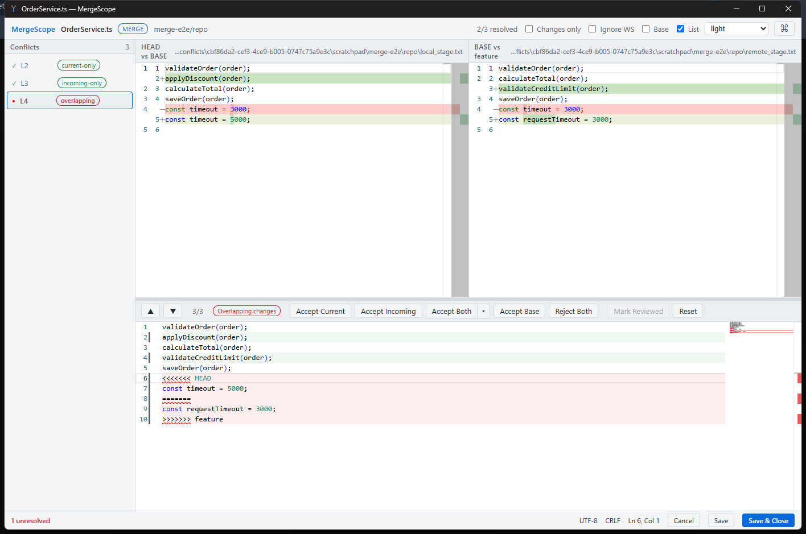

# MergeScope

Visual Git merge conflict resolution — against the common ancestor.

MergeScope is a standalone Windows desktop app (Tauri 2 + React + Monaco) that
shows **what each side changed relative to the BASE**, instead of only
comparing the two final files:

- **Current vs Base** (left panel)
- **Base vs Incoming** (right panel)
- **Editable merged result** (bottom panel)



It plugs into the standard `git mergetool` protocol, so it works from the Git
CLI, worktrees, Fork, GitKraken, VS Code terminals and any client that supports
external merge tools.

> Full technical specification: [MergeScope_Especificacao_Tecnica.md](MergeScope_Especificacao_Tecnica.md)

## Highlights

- Two independent diffs anchored on the common ancestor, with base-anchored
  scroll sync between panels.
- Conflict graph with classification per group: `current-only`,
  `incoming-only`, `independent`, `same-change`, `overlapping`,
  `delete-modify`.
- Safe changes (single-sided, identical, independent) are auto-applied and
  flagged for review; real conflicts stay as marker blocks — nothing is picked
  silently.
- Resolution actions: Accept Current / Incoming / Both (either order) / Base /
  Reject, plus free manual editing of the result with undo/redo, search and
  syntax highlighting.
- Conflict list sidebar, keyboard navigation, Command Palette
  (`Ctrl+Shift+P`), and a Settings panel (`Ctrl+,`).
- Fully customizable: interface language (English / Português-BR), UI and editor
  fonts and sizes, remappable keyboard shortcuts, and themes —
  dark/light/system/high-contrast plus a **custom** theme with per-token color
  editing (diff colors, text, accents, and more).
- Encoding and EOL fidelity: UTF-8 (with/without BOM), CRLF/LF and trailing
  newline are preserved on save; mixed EOL is flagged.
- Atomic writes (temp file + rename on the same volume), external-change
  detection (hash) before saving, optional backup.
- Exit codes follow the mergetool contract: `0` saved, `1` canceled/unresolved,
  `2` invalid args, `3` read failure, `4` write failure.
- 100% local processing: no network, no telemetry (see `docs/decisions`).

## Repository layout

```
apps/desktop           # Tauri app (React frontend + src-tauri Rust backend)
packages/merge-engine  # TypeScript merge analysis engine (diff, graph, resolutions)
fixtures/              # Spec §28.4 test fixtures (one directory per scenario)
docs/                  # Architecture, integrations, ADRs
scripts/               # Icon generation, git mergetool setup
```

## Building

Prerequisites: Node.js ≥ 20, Rust (MSVC toolchain), VS 2022 Build Tools (C++).

```bash
npm install
npm test                                # engine + UI store tests (vitest)
cargo test                              # run inside apps/desktop/src-tauri
npm run tauri build --workspace @mergescope/desktop   # release exe + NSIS installer
```

Artifacts:

- `apps/desktop/src-tauri/target/release/mergescope.exe`
- `apps/desktop/src-tauri/target/release/bundle/nsis/MergeScope_0.1.0_x64-setup.exe`

For UI development without Rust: `npm run dev` opens a browser demo session
with representative conflict data.

## Using with Git

Quick setup (after installing/building):

```powershell
scripts\setup-git-mergetool.ps1 -ExePath "C:\Program Files\MergeScope\MergeScope.exe"
```

Or manually:

```bash
git config --global merge.tool mergescope
git config --global mergetool.mergescope.cmd '"C:/Program Files/MergeScope/MergeScope.exe" --base "$BASE" --current "$LOCAL" --incoming "$REMOTE" --result "$MERGED" --wait'
git config --global mergetool.mergescope.trustExitCode true
git config --global mergetool.prompt false
```

Then, whenever a merge/rebase/cherry-pick conflicts:

```bash
git mergetool
```

Diagnostics: `mergescope doctor`. CLI reference: `mergescope --help`.

Client-specific guides: [Git](docs/integrations/git.md) ·
[Fork](docs/integrations/fork.md) · [GitKraken](docs/integrations/gitkraken.md)
### Fork (Windows)

1. Open **File → Preferences → Integration** (Git section).
2. Set **Merge tool** to **Custom**.
3. Fill in the fields below (adjust the path if MergeScope was installed for a
   different Windows user):

```text
Executable:
C:\Users\<your-user>\AppData\Local\MergeScope\mergescope.exe

Arguments:
--base "$BASE" --current "$LOCAL" --incoming "$REMOTE" --result "$MERGED" --wait
```

If you are using a local release build instead of the installer, use
`apps\desktop\src-tauri\target\release\mergescope.exe` as the executable.

When Fork reports a conflict, right-click the conflicted file and choose
**Open in External Merge Tool** (the exact label can vary by Fork version).
Resolve it in MergeScope, select **Save & Close**, then return to Fork and
stage/mark the file as resolved.

### GitKraken (Windows)

GitKraken does not consistently support arbitrary custom merge-tool
executables. The reliable setup is to configure MergeScope as Git's global
merge tool first:

```powershell
scripts\setup-git-mergetool.ps1 -ExePath "$env:LOCALAPPDATA\MergeScope\mergescope.exe"
```

Then, when GitKraken reports a conflict:

1. Open GitKraken's built-in terminal for the repository.
2. Run `git mergetool` (or `git mergetool path/to/file` for one file).
3. Resolve the conflict in MergeScope and select **Save & Close**.
4. Return to GitKraken and stage/mark the updated file as resolved.

If your GitKraken version has **Preferences → Git → Merge tool** and
offers **Use Git's configured tool** (or equivalent), select it after applying
the global Git configuration above.

## Keyboard shortcuts

| Action              | Shortcut       |
| ------------------- | -------------- |
| Save                | `Ctrl+S`       |
| Cancel/close        | `Esc`          |
| Next conflict       | `Alt+Down`     |
| Previous conflict   | `Alt+Up`       |
| Accept Current      | `Alt+1`        |
| Accept Incoming     | `Alt+2`        |
| Accept Both         | `Alt+3`        |
| Command Palette     | `Ctrl+Shift+P` |
| Settings            | `Ctrl+,`       |
| Find (focused pane) | `Ctrl+F`       |

All shortcuts (except Find, handled by the editor) are remappable in
**Settings → Shortcuts**.

## Customization

Open the Settings panel from the ⚙ button in the top bar, the `Ctrl+,` shortcut,
or the Command Palette. Everything persists to
`%APPDATA%/MergeScope/settings.json`:

- **Appearance** — pick a theme, or choose **Custom** to edit every color token
  (background, text, accent, diff added/removed, conflict, …) live.
- **Font** — set the interface and editor font family and size independently.
- **Language** — switch between English and Português (Brasil).
- **Shortcuts** — click a command's shortcut to record a new key chord;
  `Backspace` clears it and `↺` restores the default.

## Status

MVP (spec phases 0–2): functional and verified end-to-end on Windows —
`git mergetool` launch, real conflict resolution, atomic save with CRLF/BOM
fidelity, exit codes, NSIS installer. See
[docs/decisions/adr.md](docs/decisions/adr.md) for scope decisions and
[docs/architecture/overview.md](docs/architecture/overview.md) for the module
map. Roadmap phases 3–4 (repository launcher, move detection, macOS/Linux,
semantic plugins) are not implemented yet.

## Contributing

Contributions are welcome — see [CONTRIBUTING.md](CONTRIBUTING.md) for setup,
conventions, and how to add translations, themes, and shortcuts.

## License

MIT — see [LICENSE](LICENSE).
