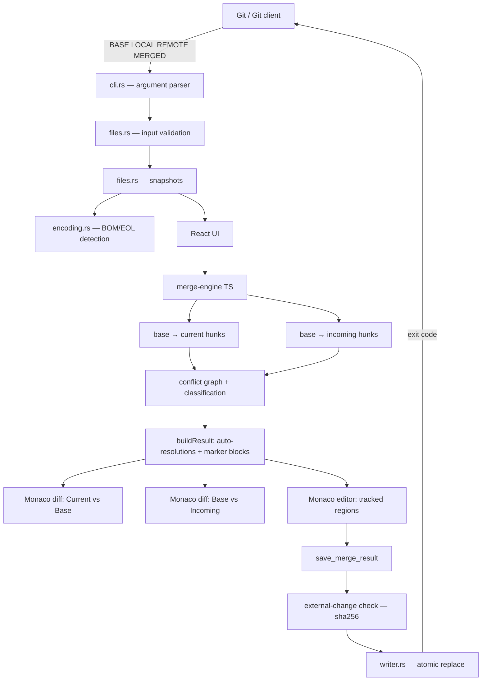

# Architecture overview

## Modules

### `packages/merge-engine` (TypeScript, pure)

| File           | Responsibility                                                      |
| -------------- | ------------------------------------------------------------------- |
| `diff.ts`      | Line diff (jsdiff) normalized into `insert/delete/modify` hunks     |
| `correlate.ts` | Conflict graph: union-find of hunks whose base intervals touch      |
| `classify.ts`  | `current-only … overlapping/delete-modify/unknown` classification   |
| `apply.ts`     | Apply one side's hunks (or both, for independent groups) to a range |
| `resolve.ts`   | Strategy outputs, auto-resolutions, full result build with regions  |
| `markers.ts`   | Conflict-marker parser (standard, diff3, zdiff3) with diagnostics   |
| `text.ts`      | `\n` normalization, split/join with trailing-newline fidelity       |

### `apps/desktop/src` (React)

| Area                  | Responsibility                                                       |
| --------------------- | -------------------------------------------------------------------- |
| `stores/session.ts`   | Zustand store: session lifecycle, resolutions, save/cancel, dialogs  |
| `stores/controllers`  | Imperative bridge store ↔ Monaco editors                             |
| `components/diff`     | Read-only diff panels (original = BASE) + pinned base viewer         |
| `components/result`   | Editable result with decoration-tracked regions + resolution toolbar |
| `components/layout`   | Top bar, status bar, resizable split panes                           |
| `features/`           | Shortcuts, command registry, base-anchored scroll sync               |
| `services/backend.ts` | Tauri IPC wrapper with a browser demo fallback                       |

### `apps/desktop/src-tauri` (Rust)

| File          | Responsibility                                                     |
| ------------- | ------------------------------------------------------------------ |
| `main.rs`     | Startup, validation, exit-code enforcement on `RunEvent::Exit`     |
| `cli.rs`      | Argument parsing + aliases + `--help/--version/doctor`             |
| `files.rs`    | Snapshot reads (content + hash + metadata), input validation       |
| `encoding.rs` | UTF-8/BOM + CRLF/LF/mixed detection and re-serialization           |
| `writer.rs`   | Atomic write (temp + rename same volume), optional backup          |
| `git.rs`      | Worktree root/branch/operation detection (fixed args, no shell)    |
| `commands.rs` | IPC commands: open session, save (hash-guarded), prefs, exit codes |
| `doctor.rs`   | Environment diagnostics                                            |
| `logging.rs`  | Local metadata-only logs (`%LOCALAPPDATA%\MergeScope\logs`)        |

## Key flows

**Open:** Rust validates and snapshots the four files → frontend runs the
engine → result buffer generated (auto-resolved + marker blocks) → regions
anchored as Monaco decorations.

**Resolve:** toolbar/palette/shortcut → strategy output computed by the
engine → `replaceRegion` edit (undo-able) → group status updated → status
bar/list repainted.

**Save:** buffer text → Rust re-hashes the file on disk (external-change
guard) → EOL/BOM restored → atomic replace → new hash returned → exit code 0
armed (or 1 if markers remain).
